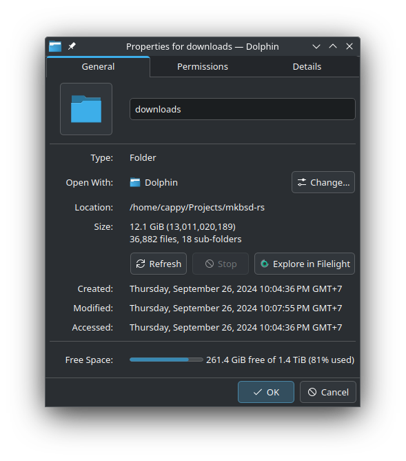

# mkbsd-rs

A port of [mkbsd](https://github.com/nadimkobeissi/mkbsd) in (Multi-threaded) Rust

Rip Mark-ass Brownlee's wallpapers at blazingly fast speeds! 🚀

This Rust program makes use of [tokio](https://tokio.rs/) to parallelize the process of downloading all the wallpapers from the Panels API, allowing all wallpapers
to be downloaded simultaneously.

This version attempts to parse the full spec JSON from the API and downloads _every_ single image, in every single gallery, in every single form factor, essentially doing a full
rip of the entire backend storage from [imgix](https://imgix.com)

Here's an output of the full rip:

This program has two backends for downloading files:

- The original verbose mode, which downloads all the images using the "API" bucket which includes every pre-cropped form factor. This uses a lot of storage so be warned.
- The "simple" mode, which crawls the CDN manifests and downloads the original images from there.

By default, the simple mode will be selected to save storage.

## Why?

1. the original code isn't fast enough for me I have a 1GbE connection
2. This thing is embarrassingly parallel
3. I love free shit
4. My 1GbE plan is cheaper than this app
5. spamming imgix is funny

## Aren't you stealing from artists?

yea, but so is piracy in general. if you really like what you see just pay for it, see `LICENSE` for my full opinion

## Usage

1. [Get Rust](https://rustup.rs)
2. Clone this project and enter the project directory
3. `cargo run --release`
4. Wait

All the images should appear in the `downloads` directory.

For more options, refer to the help page in the command (`--help`)

## License

Do whatever the fuck you want.
